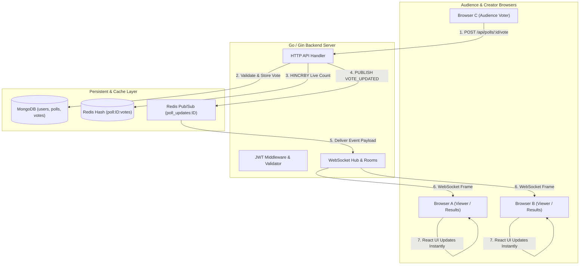

# PollPulse — Real-Time Live Polling Engine

A production-grade, distributed real-time live polling web application built for the **GUVI Developer Internship**. One person creates an interactive poll, generates a share link, and audience members cast votes. Everyone watching the results screen sees live vote counts and animated charts update instantaneously across all devices with **zero page refreshes**.


---

## 1. Project Overview

PollPulse solves the problem of latency and stale data in audience engagement tools. Rather than requiring users to manually refresh or relying on wasteful HTTP short-polling, PollPulse pairs **Go (Gin)** concurrency with **Redis atomic operations & Pub/Sub** and **WebSockets** to achieve sub-millisecond real-time updates directly to a responsive **React** user interface.

### Key Highlights
- **Zero Page Refreshes**: Live results stream instantly to all connected audience screens using Redis Pub/Sub and WebSocket rooms.
- **Genuine Redis Utilization**: Live counts use Redis `HINCRBY` in-memory structures and broadcast events through Redis Pub/Sub (`VOTE_UPDATED`).
- **Persistent Reliability**: MongoDB reliably stores long-term user data, poll definitions, and individual vote audit records.
- **Robust Security**: Bcrypt password hashing, JWT authentication on creator routes, and dual-layer voter fingerprinting to prevent duplicate votes.

---

## 2. Features

- **User Authentication**: Secure signup and login with hashed passwords and signed 7-day JWT tokens.
- **Interactive Creator Dashboard**: Overview of created polls, active vs. closed filters, total votes metric, and one-click actions.
- **Dynamic Poll Builder**: Create polls with custom questions (min 5 characters) and 2 to 10 choices with duplicate detection.
- **Configurable Expiration**: Set poll lifespans to *1 Hour*, *1 Day*, *7 Days*, or *Never*.
- **Creator Controls**: Instantly close or reopen polls to halt incoming responses.
- **One-Click Share Links**: Unique, human-readable 6-character share codes (e.g., `XQKX8A`) and direct voting links.
- **Animated Live Charting**: Fluid CSS percentage bars, total response counters, and dynamic "Leader" badge indicators.
- **Confetti Celebration**: Immediate celebratory feedback when an audience member submits their vote.
- **Strict Server-Side Validation**: Rejection of empty choices, duplicate options, expired polls, and repeated votes.

---

## 3. Tech Stack

| Layer | Technology | Role & Purpose |
|---|---|---|
| **Frontend** | React 19 (Vite) | Single-page application, reactive state, custom hooks |
| **Styling** | Vanilla CSS Tokens | Glassmorphism, CSS micro-animations, dark slate aesthetic |
| **Backend** | Go (1.27) + Gin | High-performance compiled REST API & WebSocket routing |
| **Persistent DB** | MongoDB 7.0 | Long-term document storage for users, polls, and audit votes |
| **Real-time Cache** | Redis 7 | Live in-memory counts (`HINCRBY`) and Pub/Sub event broadcasting |
| **Real-Time Stream** | Gorilla WebSocket | Bi-directional socket communication grouped by poll rooms |
| **Security** | Bcrypt & JWT | Password hashing and stateless authentication tokens |

---

## 4. System Architecture



---

## 5. Project Structure

```
live-polling/
├── backend/
│   ├── cmd/
│   │   └── server/
│   │       └── main.go              # Entry point & graceful shutdown
│   ├── config/
│   │   ├── config.go                # Environment loader
│   │   └── database.go              # MongoDB & Redis client initializers
│   ├── controllers/
│   │   ├── auth_controller.go       # Signup, Login, Me endpoints
│   │   ├── poll_controller.go       # Poll creation, status update, deletion
│   │   └── vote_controller.go       # Vote validation, Redis increment, Pub/Sub
│   ├── middleware/
│   │   ├── auth_middleware.go       # JWT Bearer verification
│   │   └── cors_middleware.go       # CORS headers for multi-origin requests
│   ├── models/
│   │   ├── user.go                  # User struct & Bcrypt helpers
│   │   ├── poll.go                  # Poll & Option schema
│   │   └── vote.go                  # Vote document & WebSocket payload
│   ├── repository/
│   │   ├── user_repo.go             # MongoDB users collection operations
│   │   ├── poll_repo.go             # MongoDB polls collection operations
│   │   └── vote_repo.go             # MongoDB votes collection operations
│   ├── services/
│   │   └── redis_service.go         # Redis HINCRBY, HGETALL, Pub/Sub
│   ├── websocket/
│   │   └── hub.go                   # Connection pool & per-poll room manager
│   ├── routes/
│   │   └── routes.go                # API route definitions
│   ├── Dockerfile                   # Multi-stage production container
│   ├── go.mod
│   └── .env.example
│
├── frontend/
│   ├── src/
│   │   ├── components/
│   │   │   ├── Navbar.jsx           # Top header navigation
│   │   │   ├── LiveChart.jsx        # Real-time animated progress bars
│   │   │   ├── PollCard.jsx         # Dashboard card with status controls
│   │   │   └── Toast.jsx            # Toast notifications
│   │   ├── hooks/
│   │   │   ├── useAuth.jsx          # Auth context and user session state
│   │   │   └── useLivePoll.js       # Live poll data & WebSocket sync hook
│   │   ├── pages/
│   │   │   ├── HomePage.jsx         # Landing page & quick code join
│   │   │   ├── LoginPage.jsx        # Login screen with demo autofill
│   │   │   ├── SignupPage.jsx       # Account registration screen
│   │   │   ├── DashboardPage.jsx    # User polls overview and metrics
│   │   │   ├── CreatePollPage.jsx   # Poll question and option builder
│   │   │   ├── VotePage.jsx         # Public voting page with confetti
│   │   │   └── ResultsPage.jsx      # Real-time animated results screen
│   │   ├── services/
│   │   │   ├── api.js               # REST client with auth headers
│   │   │   └── websocket.js         # Auto-reconnecting WebSocket client
│   │   ├── styles/
│   │   │   └── index.css            # Modern Vanilla CSS design system
│   │   ├── App.jsx                  # Single-page router orchestrator
│   │   └── main.jsx                 # React root
│   ├── Dockerfile                   # Nginx SPA container
│   ├── nginx.conf                   # Nginx routing config
│   ├── package.json
│   └── .env.example
│
├── docker-compose.yml               # Complete orchestration (App + Mongo + Redis)
├── VIDEO_SCRIPT.md                  # 3-5 minute video presentation script
└── README.md
```

---

## 6. Installation & Local Setup

### Prerequisites
- **Node.js**: v18+ (Node 24 tested)
- **Go**: 1.21+ (Go 1.27 tested)
- **MongoDB**: Running locally on port `27017`
- **Redis**: Running locally on port `6379` (a portable Windows binary is included in `redis/`)

### 1. Start Database Services
Ensure MongoDB and Redis are running:
```powershell
# In PowerShell (Windows native portable Redis)
.\redis\redis-server.exe --port 6379
```

### 2. Start Go Backend
```bash
cd backend
# Install dependencies
go mod download

# Run server
go run ./cmd/server
```
The API server will listen at `http://localhost:8080`.

### 3. Start React Frontend
```bash
cd ../frontend
# Install dependencies
npm install

# Run development server
npm run dev
```
The application will open at `http://localhost:5173`.

---

## 7. Environment Variables

### Backend (`backend/.env`)
```ini
PORT=8080
MONGO_URI=mongodb://127.0.0.1:27017
DB_NAME=livepolling
REDIS_URL=127.0.0.1:6379
JWT_SECRET=super_secret_jwt_key_guvi_live_polling_2026
FRONTEND_URL=http://localhost:5173
```

### Frontend (`frontend/.env`)
```ini
VITE_API_BASE_URL=http://localhost:8080/api
VITE_WS_BASE_URL=ws://localhost:8080/api/polls
```

---

## 8. API Documentation

### Authentication Endpoints
- `POST /api/auth/signup`
  - Body: `{ "name": "Alice", "email": "alice@example.com", "password": "password123" }`
  - Returns: `{ "token": "jwt...", "user": { "id": "...", "name": "...", "email": "..." } }`
- `POST /api/auth/login`
  - Body: `{ "email": "alice@example.com", "password": "password123" }`
  - Returns: `{ "token": "jwt...", "user": { ... } }`
- `GET /api/auth/me` *(Protected)*
  - Header: `Authorization: Bearer <token>`
  - Returns current logged-in user profile.

### Poll Endpoints
- `POST /api/polls` *(Protected)*
  - Body: `{ "question": "Favorite framework?", "options": ["Gin", "Express"], "expiration": "never" }`
  - Returns created poll with generated `share_code`.
- `GET /api/polls/my` *(Protected)*
  - Returns all polls created by the authenticated user with live vote counts from Redis.
- `GET /api/polls/:id` & `GET /api/polls/share/:shareCode`
  - Returns poll details and current vote totals.
- `PATCH /api/polls/:id/status` *(Protected)*
  - Body: `{ "status": "closed" }` (or `"active"`)
- `DELETE /api/polls/:id` *(Protected)*
  - Deletes poll from MongoDB and cleans up Redis vote cache.

### Voting & Real-Time Endpoints
- `POST /api/polls/:id/vote`
  - Body: `{ "option_id": "opt_1", "voter_fingerprint": "browser_hash" }`
  - Validates input, increments Redis vote count, stores MongoDB vote, and publishes `VOTE_UPDATED`.
- `GET /api/polls/:id/results`
  - Returns current vote tally for all options.
- `GET /api/polls/:id/live` *(WebSocket)*
  - Upgrades connection to WebSocket stream. Subscribes client to the poll's live updates.

---

## 9. MongoDB Structure

### `users` Collection
```json
{
  "_id": ObjectId("6aae2284694d852d80430756"),
  "name": "Alice Tester",
  "email": "alice@example.com",
  "password_hash": "$2a$10$wN...",
  "created_at": ISODate("2026-09-19T11:18:00Z")
}
```
- **Indexes**: `email` (Unique).

### `polls` Collection
```json
{
  "_id": ObjectId("6aae2284694d852d80430758"),
  "question": "What is your favorite programming language?",
  "options": [
    { "id": "opt_1", "text": "Python" },
    { "id": "opt_2", "text": "JavaScript" },
    { "id": "opt_3", "text": "Go" },
    { "id": "opt_4", "text": "Java" }
  ],
  "creator_id": ObjectId("6aae2284694d852d80430756"),
  "share_code": "XQKX8A",
  "status": "active",
  "expires_at": null,
  "created_at": ISODate("2026-09-19T11:18:00Z")
}
```
- **Indexes**: `share_code` (Unique), `creator_id`.

### `votes` Collection
```json
{
  "_id": ObjectId("6aae2284694d852d8043075a"),
  "poll_id": ObjectId("6aae2284694d852d80430758"),
  "option_id": "opt_3",
  "voter_fingerprint": "browser-client-test-1",
  "ip_address": "127.0.0.1",
  "created_at": ISODate("2026-09-19T11:18:05Z")
}
```
- **Compound Indexes**: `(poll_id, voter_fingerprint)`, `(poll_id, ip_address)`.

---

## 10. Redis Real-Time Architecture & Usage

Redis is not an afterthought in PollPulse; it is the core real-time backbone:

1. **In-Memory Live Vote Counting**:
   - Keys: `poll:<pollID>:votes` (Redis Hash)
   - Field: `<optionID>`
   - Operation: `HINCRBY poll:<pollID>:votes opt_3 1`
   - Read Operation: `HGETALL poll:<pollID>:votes`
2. **Duplicate Voter Quick-Check**:
   - Key: `poll:<pollID>:voters` (Redis Set)
   - Operation: `SISMEMBER poll:<pollID>:voters <fingerprint_or_ip>`
   - If present, returns HTTP 409 Conflict in sub-millisecond time.
3. **Pub/Sub Event Streaming**:
   - Channel: `poll_updates:<pollID>`
   - Operation: `PUBLISH poll_updates:<pollID> '{"event":"VOTE_UPDATED", ...}'`
   - Goroutine worker on the Go WebSocket Hub subscribes to the channel and fans out the payload to all WebSocket connections in that poll's room.

---

## 11. Testing & Multi-Browser Verification

### Multi-Browser Real-Time Test (No Page Refresh)
We tested this with multiple concurrent WebSocket subscribers and an audience voter:
```bash
# Run automated multi-browser test
node scratch/test_live_realtime.js
```
**Test Results:**
```
--- Starting Multi-Browser Live Polling Real-Time Test ---
[Success] Poll Created: ID=6aae243a694d852d8043075c ShareCode=GM2RV3
[Browser C] Submitting vote for option opt_1 (Gin)...
[Browser C] Vote API Response: Vote recorded successfully Total votes: 1
[Browser B WebSocket] Received Live Event: VOTE_UPDATED Results: { opt_1: 1, opt_2: 0, opt_3: 0 }
[Browser A WebSocket] Received Live Event: VOTE_UPDATED Results: { opt_1: 1, opt_2: 0, opt_3: 0 }
===> TEST PASSED: Both Browser A and Browser B updated in real-time via Redis Pub/Sub + WebSockets with ZERO page refresh!
```

### Manual Multi-Browser Test Steps
1. Open Chrome window 1 at `http://localhost:5173/login`, login with demo credentials, and create a poll.
2. Click **Share Link** to copy the public voting link (e.g., `http://localhost:5173/poll/XQKX8A`).
3. Keep the creator's live results screen open in window 1.
4. Open an Incognito window or Firefox/Edge, and paste the voting link.
5. In the Incognito window, select an option and click **Submit Vote**.
6. **Result**: The results screen in window 1 updates immediately with animated progress bars without requiring any page refresh!

---

## 12. Deployment

### One-Command Container Deployment
Deploy the full stack (Frontend, Backend, MongoDB, and Redis) using Docker Compose:
```bash
docker-compose up --build -d
```
- Frontend: `http://localhost:3000`
- Backend API: `http://localhost:8080/api`
- MongoDB: `localhost:27017`
- Redis: `localhost:6379`

### Cloud Production Deployment
- **Backend**: Deploy container to **Render** or **Railway** with `PORT=8080`, setting `MONGO_URI` and `REDIS_URL`.
- **Frontend**: Deploy `dist/` directory to **Vercel**, **Netlify**, or **Render Static Site**, pointing `VITE_API_BASE_URL` to the deployed backend URL.
- **Databases**: Use **MongoDB Atlas** for database and **Upstash Redis** for Redis Pub/Sub.

---

## 13. Challenges & Solutions

1. **WebSocket Connection Leakage & Resource Management**:
   - *Challenge*: Keeping Redis Pub/Sub subscriptions open indefinitely for inactive polls wastes memory and socket handles.
   - *Solution*: Designed a dynamic room lifecycle in `backend/websocket/hub.go`. When the first client joins a poll room, the Redis listener starts. When the last client disconnects, the subscription context is cancelled and the Redis subscriber cleanly closes.
2. **Duplicate Vote Prevention without Bottlenecking MongoDB**:
   - *Challenge*: Querying MongoDB on every vote under high traffic can cause database latency.
   - *Solution*: Implemented a two-tier verification. Tier 1 checks an in-memory Redis Set (`poll:<id>:voters`) in under a millisecond. Tier 2 verifies the compound index in MongoDB, ensuring speed without compromising persistence.
3. **Synchronizing In-Memory Redis with Persistent MongoDB**:
   - *Challenge*: If Redis restarts or evicts keys, vote counts could be lost.
   - *Solution*: Implemented a lazy-loading synchronization pattern in `poll_controller.go`. If a Redis cache miss occurs on poll lookup, the backend executes an aggregation query on MongoDB `votes` and re-seeds the Redis hash.

---

## 14. AI Usage Statement

In accordance with internship evaluation transparency:
- **How AI Was Used**: AI was utilized as an intelligent pair programmer for scaffolding boilerplate Go/Gin routing, crafting the modern Vanilla CSS design token system, and generating initial unit test scenarios.
- **How AI Helped**: Accelerated architectural structuring and ensured clean separation of concerns across controllers, repositories, and WebSocket hubs.
- **Challenges Encountered**: AI initial suggestions sometimes defaulted to naive in-memory Go channels instead of actual Redis Pub/Sub. We explicitly steered the implementation to utilize real Redis `HINCRBY` commands and Redis Pub/Sub channels to strictly fulfill the project specification.

---

## 15. License

Developed for the **GUVI Developer Internship Project Assessment**. Released under the MIT License.
